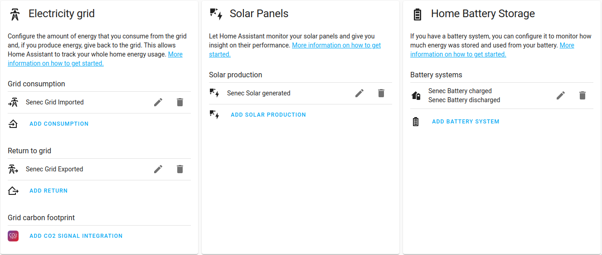
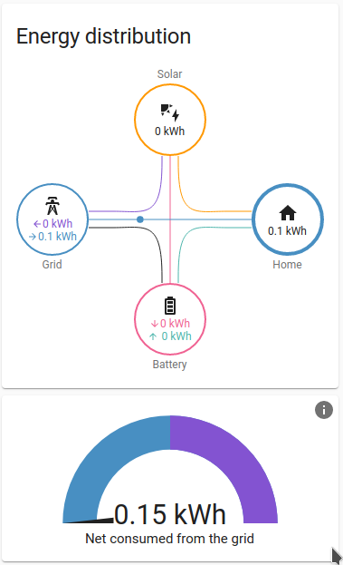

# Home Assistant sensor for Senec solar systems

## Installation

### Hacs

- Install [Home Assistant Community Store (HACS)](https://hacs.xyz/)
- Add custom repository https://github.com/mchwalisz/home-assistant-senec to HACS
- Add integration repository (search for "Senec" in "Explore & Download Repositories")
    - Select latest version or `master`
- Restart Home Assistant to install all dependencies

### Manual

- Copy all files from `custom_components/senec/` to `custom_components/senec/` inside your config Home Assistant directory.
- Restart Home Assistant to install all dependencies

### Adding or enabling integration
#### My Home Assistant (2021.3+)

#### Manual
Add custom integration using the web interface and follow instruction on screen.

- Go to `Configuration -> Integrations` and add "Senec" integration
- Provide name for the device and it's address (hostname or IP)
- Provide area where the battery is located

## Home Assistant Energy Dashboard

This integration supports Home Assistant's [Energy Management](https://www.home-assistant.io/docs/energy/)

Example setup:

Resulting energy distribution card:

